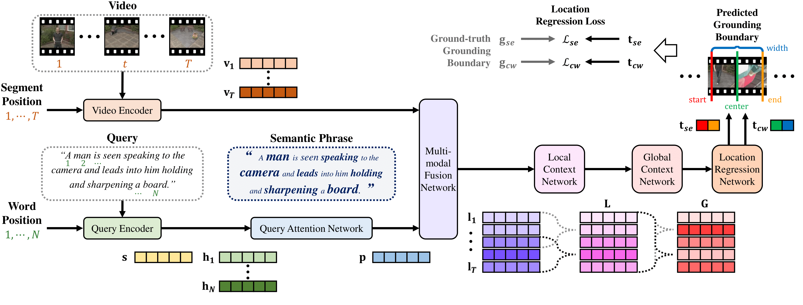

# Position-aware Location Regression Network for Temporal Video Grounding

### PLRN

Overall architecture of our PLRN.

## Reference

	@inproceedings{kim2021position,
			title={Position-aware Location Regression Network for Temporal Video Grounding},
			author={Kim, Sunoh and Yun, Kimin and Choi, Jin Young},
			booktitle={2021 17th IEEE International Conference on Advanced Video and Signal Based Surveillance (AVSS)},
			year={2021}
	}

